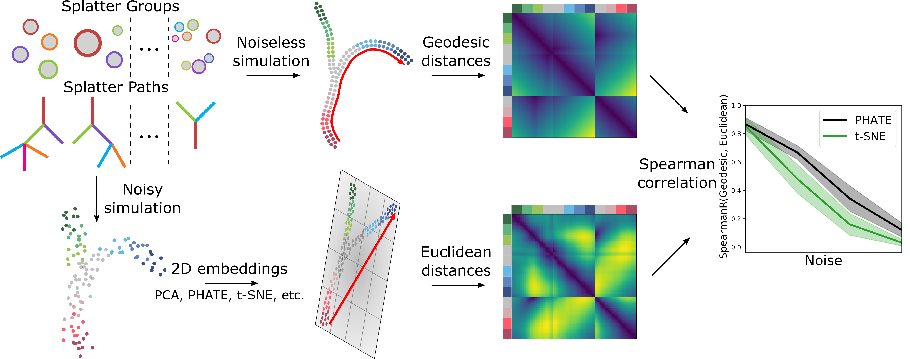
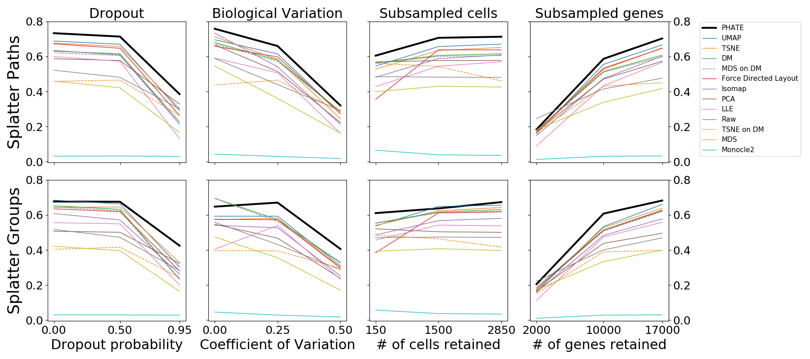

DEMaP
~~~~~

.. image:: https://zenodo.org/badge/DOI/10.1038/s41587-019-0336-3.svg
    :target: https://www.nature.com/articles/s41587-019-0336-3
    :alt: Nature Biotechnology Publication
.. image:: https://img.shields.io/twitter/follow/scottgigante.svg?style=social&label=Follow
    :target: https://twitter.com/scottgigante
    :alt: Twitter
.. image:: https://img.shields.io/github/stars/scottgigante/DEMaP.svg?style=social&label=Stars
    :target: https://github.com/scottgigante/DEMaP/
    :alt: GitHub stars

Denoised Embedding Manifold Preservation (DEMaP) is a metric for measuring the quality of dimensionality reduction for visualization.

Install
-------

Install DEMaP with ``pip``::

    pip install git+https://github.com/scottgigante/DEMaP

To install with all optional dependencies::

    git clone https://github.com/scottgigante/DEMaP
    cd DEMaP
    pip install .[scripts]

To run the Splatter simulation, you will need to have R and the Python package `rpy2`_ installed.

.. _`rpy2`: https://bitbucket.org/rpy2/rpy2/src/default/

Run
---

If you have installed R and ``rpy2``, you can run DEMaP on Splatter as follows::

    # generate data
    import demap
    import scprep
    scprep.run.install_bioconductor("splatter")
    data_true = demap.splatter.paths(bcv=0, dropout=0, seed=42)
    data_noisy = demap.splatter.paths(bcv=0.2, dropout=0.5, seed=42)

    # run demap
    embedding_phate = demap.embed.PHATE(data_noisy)
    demap_phate = demap.DEMaP(data_true, embedding_phate)
    embedding_tsne = demap.embed.TSNE(data_noisy)
    demap_tsne = demap.DEMaP(data_true, embedding_tsne)
    demap_phate, demap_tsne

Reproduce
---------

Scripts to reproduce results in the PHATE paper are provided. Either run in series::

    # setup
    git clone https://github.com/scottgigante/DEMaP
    cd DEMaP
    pip install .[scripts]

    mkdir results
    # this takes a LONG time
    python scripts/run_demap_splatter.py

    # summarize the results
    mkdir output
    python scripts/plot_demap_splatter.py
    python scripts/summarize_demap_splatter.py

or run in parallel (e.g. on a HPC cluster)::

    for i in {0..399}; do
        python scripts/run_demap_splatter.py $i &
    done

Results
-------

Below are the results from our `Nature Biotechnology publication`_.

`Moon, van Dijk, Wang, Gigante et al. **Visualizing Transitions and Structure for Biological Data Exploration**. 2019. *Nature Biotechnology*.`__

.. _`Nature Biotechnology publication`: https://doi.org/10.1038/s41587-019-0336-3

__ `Nature Biotechnology publication`_

Contributing
------------

If you wish to add your method to the comparison or improve the way we run a method, please submit a pull request.
